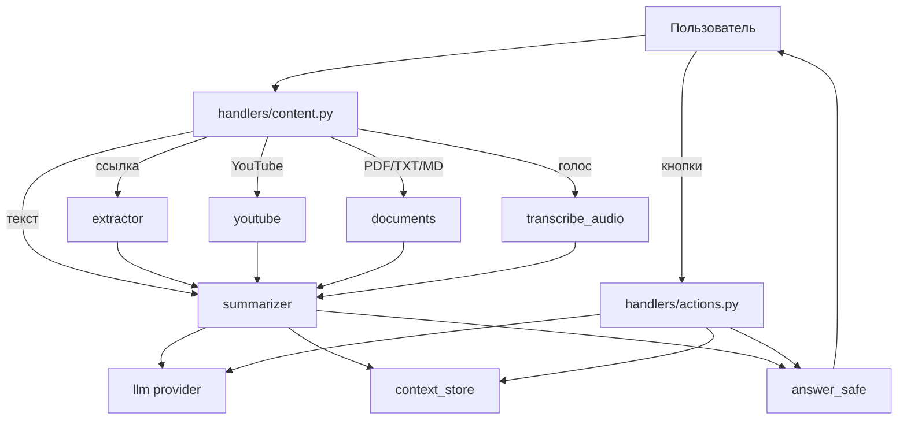

# Архитектура

Проект сделан простым: отдельные обработчики для входящих сообщений, отдельный слой для моделей и небольшие сервисы для работы с текстом.

## Поток данных

## Основные части

### `handlers/content.py`

Принимает всё, что отправил пользователь:

- текст;
- ссылку;
- YouTube;
- документ;
- голосовое или аудио.

После обработки передаёт текст в `summarizer`.

### `handlers/actions.py`

Работает с кнопками под ответом:

- сменить формат;
- задать вопрос по последнему источнику.

Для вопросов используется FSM aiogram. Хранение состояния — `MemoryStorage`.

### `llm/`

Слой для моделей. Сейчас есть два пути:

- `gemini` — Google Gemini через `google-genai`;
- `openai`, `openrouter`, `nvidia`, `groq` — через OpenAI-совместимый API.

Код приложения не зависит от конкретного провайдера. Он вызывает `complete(prompt)`.

### `config_validation.py`

Проверяет `.env` до запуска бота. Если не хватает ключа или выбран неверный провайдер, приложение показывает понятную ошибку сразу при старте.

### `services/context_store.py`

Хранит последний источник пользователя в памяти. Это нужно, чтобы кнопки работали без повторной отправки текста.

Хранилище ограничено по размеру и времени жизни, поэтому память не растёт бесконечно.

### `utils/telegram.py`

Отправляет ответ безопасно:

- режет длинный текст на сообщения до 4096 символов;
- если Telegram не принимает Markdown, отправляет тот же текст без разметки.

## Данные

В SQLite хранится только пользовательская настройка:

- Telegram ID;
- язык ответа;
- длина ответа;
- дата создания записи.

Тексты, ссылки и документы не сохраняются в базу. Последний источник лежит только в памяти и удаляется по TTL.

## Скрипты

- `scripts/setup_env.py` — создаёт `.env` через вопросы в консоли.
- `scripts/check_config.py` — проверяет текущий `.env` и показывает активную конфигурацию.

## Тесты

Тесты сделаны на чистых функциях, чтобы их можно было запускать без бота, сети и API-ключей.
